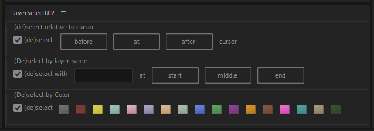

# AfterEffects-ScriptPackage

Here are mmultiple oy ma Script.

## LayerSelectUI

You can select and deselect layers relative to cursor position, by layer name or by color.

## LayerSequencer & LayerSequencer UI
AfterEffects Script which automates Layer-Animation by moving it left and right. You should use the UI-Version.

## Subtitles
Takes srt file and sets text as keyframes in textlayer.

## Proxy Switcher
Enables/Disables every proxy in the entire project. This is an UI-panel.

### Enable all proxies
Enables every proxy in the entire project

### Disable all proxies
Disables every proxy in the entire project

*Use everything at your own risk.*
